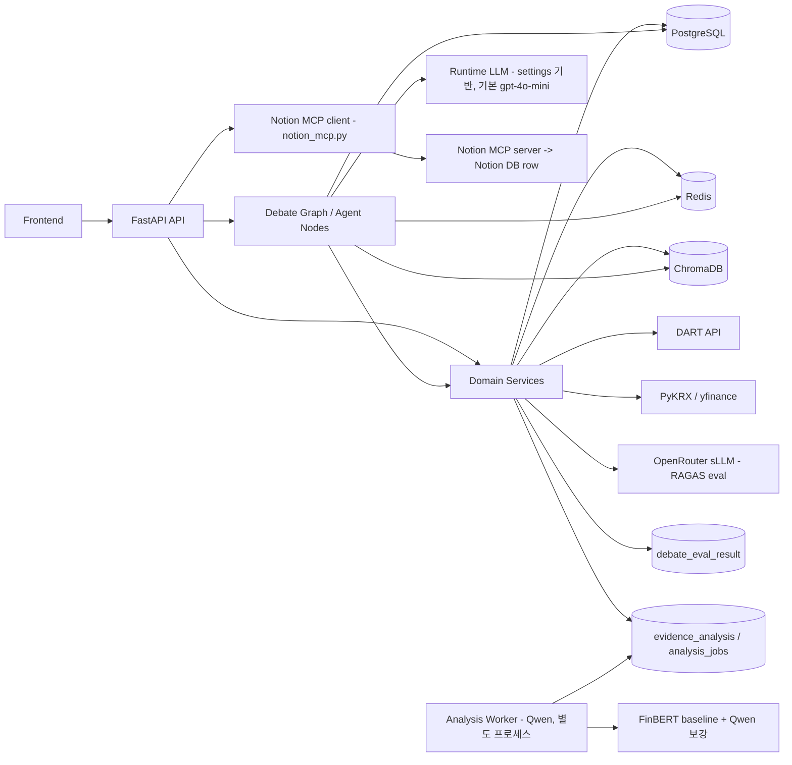

# 컴포넌트 설계서

## 문서 목적

TickerTaka 백엔드의 주요 컴포넌트와 책임, 데이터 흐름, 배포 환경을 설명한다.

## 상위 컴포넌트

1. API Layer
2. Domain Service Layer
3. Agent Runtime Layer
4. Persistence Layer
5. External Integration Layer
6. Infra Support Layer

## 1. API Layer

구성:
- `app/api/watchlist.py`
- `app/api/market_data.py`
- `app/api/debate.py`
- `app/main.py`

책임:
- HTTP 요청/응답 처리
- 입력 검증
- DB 세션 주입
- background task enqueue
- 토론 결과 Notion 발행 (`POST /api/debates/{session_id}/publish/notion`)

## 2. Domain Service Layer

구성:
- `app/domain/watchlist_service.py`
- `app/domain/debate_service.py`
- `app/domain/news_ingestion.py`
- `app/domain/price_ingestion.py`
- `app/domain/financial_ingestion.py`
- `app/domain/filing_ingestion.py`
- `app/domain/evidence_retrieval.py`
- `app/domain/evidence_indexing.py`
- `app/domain/evidence_analysis.py`
- `app/domain/debate_evaluation.py`

책임:
- 비즈니스 규칙 실행
- 캐시 적재/갱신
- valuation 계산
- evidence 검색
- 사후 평가 (RAGAS — `debate_eval_result` 영속화 + 배치/리포트)
- 뉴스/공시 **감성·투자분석**: 동기 FinBERT(`snunlp/KR-FinBert-SC`) baseline 즉시 저장 + Qwen 보강 작업 enqueue (`evidence_analysis` / `analysis_jobs`)

## 3. Agent Runtime Layer

구성:
- `app/agents/debate_graph.py`
- `app/agents/state.py`
- `app/agents/nodes/data_node.py`
- `app/agents/nodes/bull_node.py`
- `app/agents/nodes/bear_node.py`
- `app/agents/nodes/moderator_node.py`

책임:
- 토론 상태 관리
- data context 수집
- bull/bear 논증 생성
- moderator 검증/요약

## 4. Persistence Layer

구성:
- PostgreSQL
- SQLAlchemy ORM models

핵심 테이블:
- `ticker_metadata`
- `watchlist`
- `price_cache`
- `financial_cache`
- `technical_indicator_cache`
- `news_cache`
- `filing_cache`
- `debate_session`
- `agent_statement`
- `moderator_summary`
- `evidence`
- `debate_note`
- `debate_eval_result`
- `evidence_analysis`
- `analysis_jobs`
- `event_timeline`
- `data_refresh_job`

역할:
- 서비스의 단일 정합 저장소
- 토론 결과 및 캐시 저장

## 5. External Integration Layer

구성:
- `app/external/dart/client.py`
- `app/external/krx_client.py`
- `app/external/quote_client.py`
- `app/external/chroma_client.py`
- `app/core/llm_factory.py`
- `app/integrations/notion_mcp.py`

책임:
- DART 재무/공시 데이터 수집
- PyKRX 가격/기본지표 조회
- yfinance fallback
- Chroma query/upsert
- 토론 LLM 호출: `llm_factory.get_llm(role)`가 role별 `settings.{bull,bear,moderator,fallback}_model`을 선택(**기본 `gpt-4o-mini`**). 현재 공급자는 OpenAI 직접(`openai_api_key`, base_url 미지정)
- RAGAS 평가 LLM은 별도로 **OpenRouter sLLM** 사용 (`debate_evaluation.py`, 현재값 `gpt-oss-120b:free` — 모델/메트릭 변경 가능). 결과는 **`debate_eval_result` 테이블에 영속화**되고 배치(`run_ragas_eval.py`)·리포트(`ragas-<sha>.json`)·회귀테스트까지 구현됨 (메트릭: faithfulness / answer_relevancy / context_precision)
- ※ `openrouter_base_url` 설정은 잔존하나 토론 경로엔 미적용 (항목3 sLLM 전환 시 재배선 지점)
- **Notion 발행(MCP)**: `app/integrations/notion_mcp.py`가 **MCP client**로 self-host Notion MCP server(`@notionhq/notion-mcp-server`, stdio·newline-delimited JSON)를 spawn → `API-post-page`로 토론 결과를 Notion DB row(page)로 발행. PostgreSQL은 SOT, Notion은 2차 mirror
- **감성분석 sLLM**: baseline = FinBERT `snunlp/KR-FinBert-SC`(local HF), 보강 = **Qwen**(`ANALYSIS_GENERATION_MODEL`). 뉴스는 본문 스크랩(`article_scraper`), 공시는 `DartClient` 문서 fetch 후 구조화 분석
- **Qwen 서빙 백엔드**(`ANALYSIS_GENERATION_BACKEND`): `transformers`(인-프로세스 `LocalQwenEvidenceAnalyzer`, 기본) 또는 `remote`(`RemoteQwenEvidenceAnalyzer` — OpenAI 호환 HTTP). remote는 `ANALYSIS_GENERATION_BASE_URL`로 **Ollama(`/v1`)·vLLM** 양쪽을 동일 코드로 호출(엔진 교체는 URL만). 프롬프트·파서·게이팅 로직은 두 백엔드 공유

## 6. Infra Support Layer

구성:
- Redis
- ChromaDB
- 설정/캐시/가드

관련 코드:
- `app/domain/intraday_quote.py`
- `app/agents/debate_checkpoint.py`
- `app/core/debate_runtime_guard.py`
- `app/core/llm_cache.py`

책임:
- 체크포인트
- active session guard
- intraday quote cache
- vector index 보조 저장

## 7. 비동기 워커 — 감성분석 Qwen 보강

구성:
- `app/workers/analysis_worker.py` (별도 프로세스: `python -m app.workers.analysis_worker`)
- `app/repositories/analysis_jobs_repository.py`, `app/repositories/evidence_analysis_repository.py`

책임:
- `analysis_jobs` 큐를 폴링(`claim_batch`)해 무거운 **Qwen 구조화 분석**을 후처리
- 뉴스는 본문 스크랩, 공시는 DART 문서 fetch → `evidence_analysis` 갱신
- 모델은 **워커 프로세스에만 1회 로드**(웹 프로세스 메모리 비압박), 실패는 `attempts`/`max_attempts`로 격리
- 동기 인덱싱이 FinBERT baseline을 즉시 저장하므로, **워커 미기동 시에도 baseline 감성은 제공**됨

## 8. 관측성 (Langfuse 트레이싱)

구성:
- `app/core/tracing.py` — 게이트 클라이언트 `get_langfuse()`
- 계측 지점: `evidence_analysis.py`의 `analyze_text`(부모 `evidence-enrich` span) + Qwen `analyze()`(generation span / remote는 `langfuse.openai` 드롭인 자동계측), 워커 종료 시 `flush`

계측 범위 — **양쪽 경로 모두 trace**:
- **감성분석 sLLM(Qwen)**: `evidence_analysis.py`의 `analyze_text`(부모 `evidence-enrich` span) + Qwen `analyze()`(generation span) → 분석 1건을 1 trace로, 단계별 입출력·토큰·latency·drop 기록.
- **토론 경로(bull/bear/moderator)**: `debate_service.py` `_astream_with_config`가 graph config에 `langfuse.langchain.CallbackHandler`를 주입(태그 `debate`)해 모든 토론 LLM 호출을 적재.

책임:
- 호출 1건을 **1 trace**로 묶어 단계별 가시화(진단 + 평가 항목3 관측성 충족)
- **게이트**: `LANGFUSE_PUBLIC_KEY`+`SECRET_KEY`+`LANGFUSE_TRACING_ENABLED`가 모두 있을 때만 활성, 하나라도 없으면 `None` 반환 → 호출부 전부 no-op(운영/테스트 영향 0)
- (정정) 강사 합의는 **"토론 Agent를 sLLM으로 바꾸지 않아도 된다"**였을 뿐 langfuse 적용 범위 제한이 아니다. 토론은 프런티어(gpt-4o-mini) 유지하되 trace는 붙는다.

## 9. MCP (양방향)

- **클라이언트(소비)**: `app/integrations/notion_mcp.py` — Notion MCP 서버를 stdio로 호출해 토론 발행(현재 자체 JSON-RPC 구현).
- **서버(제공)**: `app/mcp_server.py` — 공식 `mcp` SDK(FastMCP)로 도메인 기능을 tool로 노출. 기존 FastAPI route 함수를 `db=<session>`으로 직접 호출해 로직 재사용(중복 0). tool: `list_available_symbols`/`get_stock_detail`/`get_watchlist_feed`/`list_debates`/`get_debate`/`start_debate`. stdio 기동(`python -m app.mcp_server`) → Claude Desktop 등 외부 MCP 클라이언트가 호출.
- 책임: 우리 시스템이 **MCP 소비자이자 제공자**(양방향)가 됨. 데이터 제약(수집된 종목만 의미)은 `list_available_symbols`로 노출.

## 배포/실행 환경

현재 기준:

| 컴포넌트 | 위치 | 역할 |
|---|---|---|
| FastAPI app | 개발자 로컬 | API 및 agent runtime 실행 |
| PostgreSQL | NCP 원격 | 단일 SOT |
| Redis | 개발자 로컬 Docker | lock/checkpoint/quote cache |
| ChromaDB | 개발자 로컬 Docker | news/filing vector index |

정책:
- `DATABASE_URL`은 NCP 원격 호스트 유지
- `REDIS_URL`, `CHROMA_URL`은 로컬 또는 compose 서비스명 사용
- Redis/Chroma는 재생성 가능, PostgreSQL은 기준 데이터 저장소

## 컴포넌트 관계도

## 설계 원칙

- PostgreSQL 중심 정합성
- Redis/Chroma fail-soft
- 외부 소스 실패 시 graceful degradation
- API와 agent runtime 분리
- 평가/시연용 문서와 코드 경로 1:1 대응
