# ERD

## 문서 목적

현재 SQLAlchemy 모델 기준 핵심 엔터티 관계를 정리한다.  
기준 파일:
- `app/models/user.py`
- `app/models/watchlist.py`
- `app/models/ticker.py`
- `app/models/cache.py`
- `app/models/debate.py`

## 핵심 엔터티

- `app_user`
- `ticker_metadata`
- `watchlist`
- `price_cache`
- `financial_cache`
- `technical_indicator_cache`
- `news_cache`
- `filing_cache`
- `event_timeline`
- `data_refresh_job`
- `debate_session`
- `agent_statement`
- `moderator_summary`
- `evidence`
- `debate_note`
- `debate_eval_result`
- `evidence_analysis`
- `analysis_jobs`

## 관계 요약

| 부모 | 관계 | 자식 | 비고 (제약/FK) |
|---|:---:|---|---|
| `app_user` | 1:N | `watchlist` | `uq_watchlist(user_id, symbol)` |
| `app_user` | 1:N | `debate_session` | `user_id` FK, `ON DELETE CASCADE` |
| `app_user` | 1:N | `debate_note` | `uq_debate_note(user_id, session_id)` |
| `app_user` | 1:N | `data_refresh_job` | `user_id` FK `SET NULL` (nullable) |
| `ticker_metadata` | 1:N | `watchlist` | PK=`symbol`(String) — caches는 id 아닌 **symbol FK** |
| `ticker_metadata` | 1:N | `price_cache` / `financial_cache` / `technical_indicator_cache` | 각 `ON DELETE CASCADE` |
| `ticker_metadata` | 1:N | `news_cache` / `filing_cache` / `event_timeline` | 각 `ON DELETE CASCADE` |
| `ticker_metadata` | 1:N | `data_refresh_job` / `debate_session` | `debate_session.symbol`은 CASCADE 미지정 |
| `debate_session` | 1:N | `agent_statement` | `uq_statement_order(session_id, round_order)` |
| `debate_session` | 1:1 | `moderator_summary` | `session_id` **unique** → 실질 1:1 |
| `debate_session` | 1:N | `debate_note` | `ON DELETE CASCADE` |
| `debate_session` | 1:N | `debate_eval_result` | `session_id` FK, `ON DELETE CASCADE` — RAGAS 사후평가 결과 |
| `debate_session` | 0..1:N | `debate_session` | **self-ref** `cached_from_session_id` → 토론 결과 캐시 재사용 |
| `agent_statement` | 1:N | `evidence` | `ON DELETE CASCADE` |
| `news/filing/price/financial/technical_cache` | 0..N:N | `evidence` | 5개 cache FK 모두 nullable·`ON DELETE SET NULL` (근거 원본 삭제돼도 발췌는 보존) |
| `news_cache`·`filing_cache` | 0..N (soft) | `evidence_analysis` | `(source_type, source_id)` 다형 참조(하드 FK 없음), `uq(source_type, source_id, prompt_version)` |
| (동기 인덱싱) | enqueue | `analysis_jobs` | Qwen 보강 비동기 큐, `uq(source_type, source_id, prompt_version)` |

## Mermaid ERD (속성 포함)

```mermaid
erDiagram
    APP_USER ||--o{ WATCHLIST : has
    APP_USER ||--o{ DEBATE_SESSION : starts
    APP_USER ||--o{ DEBATE_NOTE : annotates
    APP_USER ||--o{ DATA_REFRESH_JOB : requests
    TICKER_METADATA ||--o{ WATCHLIST : tracks
    TICKER_METADATA ||--o{ PRICE_CACHE : stores
    TICKER_METADATA ||--o{ FINANCIAL_CACHE : stores
    TICKER_METADATA ||--o{ TECHNICAL_INDICATOR_CACHE : stores
    TICKER_METADATA ||--o{ NEWS_CACHE : stores
    TICKER_METADATA ||--o{ FILING_CACHE : stores
    TICKER_METADATA ||--o{ EVENT_TIMELINE : stores
    TICKER_METADATA ||--o{ DATA_REFRESH_JOB : refreshes
    TICKER_METADATA ||--o{ DEBATE_SESSION : targets

    DEBATE_SESSION ||--o{ AGENT_STATEMENT : contains
    DEBATE_SESSION ||--o| MODERATOR_SUMMARY : summarizes
    DEBATE_SESSION ||--o{ DEBATE_NOTE : noted_by
    DEBATE_SESSION ||--o{ DEBATE_EVAL_RESULT : evaluated_by
    DEBATE_SESSION ||--o{ DEBATE_SESSION : cached_from
    AGENT_STATEMENT ||--o{ EVIDENCE : cites

    PRICE_CACHE ||--o{ EVIDENCE : referenced_by
    FINANCIAL_CACHE ||--o{ EVIDENCE : referenced_by
    TECHNICAL_INDICATOR_CACHE ||--o{ EVIDENCE : referenced_by
    NEWS_CACHE ||--o{ EVIDENCE : referenced_by
    FILING_CACHE ||--o{ EVIDENCE : referenced_by

    NEWS_CACHE ||..o{ EVIDENCE_ANALYSIS : analyzed
    FILING_CACHE ||..o{ EVIDENCE_ANALYSIS : analyzed

    APP_USER {
        uuid id PK
        string email UK
        string password_hash
        string name
    }
    TICKER_METADATA {
        string symbol PK
        string name_kr
        string name_en
        enum market "KOSPI|KOSDAQ|NASDAQ|NYSE|AMEX|OTHER"
        string sector
        string industry
        bool is_active
    }
    WATCHLIST {
        uuid id PK
        uuid user_id FK
        string symbol FK
        string memo
    }
    DEBATE_SESSION {
        uuid id PK
        uuid user_id FK
        string symbol FK
        enum category "technical|financial|market|macro|synthesis"
        enum mode "moderator"
        enum status "pending|running|completed|failed"
        uuid cached_from_session_id FK "self-ref, nullable"
        string cache_key "partial-unique when not null"
        datetime started_at
        datetime completed_at
        text error_message
        string notion_page_id "nullable — Notion 발행 시"
        string notion_page_url "nullable"
        datetime notion_published_at "nullable"
    }
    AGENT_STATEMENT {
        uuid id PK
        uuid session_id FK
        enum round "opening|rebuttal|closing|summary"
        int round_order "uq(session_id, round_order)"
        enum agent_role "bull|bear|moderator|system"
        text content
        string model_name
        int prompt_tokens
        int completion_tokens
        int latency_ms
    }
    EVIDENCE {
        uuid id PK
        uuid statement_id FK
        enum source_type "DART|NEWS|PRICE|FINANCIAL|TECHNICAL|INDUSTRY|MACRO|USER_INPUT|OTHER"
        string source_url
        string source_label
        text source_title
        text excerpt
        datetime retrieved_at
        uuid news_cache_id FK "nullable SET NULL"
        uuid filing_cache_id FK "nullable SET NULL"
        uuid price_cache_id FK "nullable SET NULL"
        uuid financial_cache_id FK "nullable SET NULL"
        uuid technical_indicator_cache_id FK "nullable SET NULL"
    }
    MODERATOR_SUMMARY {
        uuid id PK
        uuid session_id FK "unique"
        text summary_content
        jsonb key_points
    }
    DEBATE_NOTE {
        uuid id PK
        uuid user_id FK
        uuid session_id FK
        bool is_favorite
        text user_memo
    }
    DEBATE_EVAL_RESULT {
        uuid id PK
        uuid session_id FK
        string eval_type "summary_faithfulness|summary_answer_relevancy|evidence_precision"
        float score "nullable, 0.0~1.0 (None=실패)"
        string model_used
        text error
        datetime eval_at
    }
    PRICE_CACHE {
        uuid id PK
        string symbol FK
        date price_date "uq(symbol, price_date)"
        numeric close_price
        bigint volume
        numeric change_rate
    }
    FINANCIAL_CACHE {
        uuid id PK
        string symbol FK
        int fiscal_year "uq(symbol, year, quarter)"
        int fiscal_quarter
        numeric per
        numeric pbr
        numeric roe
        numeric debt_ratio
    }
    TECHNICAL_INDICATOR_CACHE {
        uuid id PK
        string symbol FK
        date indicator_date "uq(symbol, date)"
        numeric ma20
        numeric rsi14
        numeric macd
    }
    NEWS_CACHE {
        uuid id PK
        string symbol FK
        text title
        string source_url "unique (dedup)"
        datetime published_at
        datetime ttl_until
    }
    FILING_CACHE {
        uuid id PK
        string symbol FK
        text filing_title
        string dart_receipt_no "unique"
        string source_url
        datetime disclosed_at
        datetime ttl_until
    }
    EVENT_TIMELINE {
        uuid id PK
        string symbol FK
        date event_date "uq(symbol, date, title)"
        string event_title
        string event_type
        string event_status
    }
    DATA_REFRESH_JOB {
        uuid id PK
        uuid user_id FK "nullable"
        string symbol FK
        enum job_type "price|news|filing|financial|technical|event|all"
        enum status "queued|published|running|completed|failed|skipped"
        int priority
        int retry_count
        int max_retries
    }
    EVIDENCE_ANALYSIS {
        uuid id PK
        string source_type "news|filing"
        uuid source_id "news/filing cache id (soft ref)"
        string symbol
        string sentiment "positive|negative|neutral|mixed"
        int impact_score "-2~+2"
        numeric confidence "0~1, nullable"
        string event_type "공시 사건유형, nullable"
        text summary
        jsonb key_points
        jsonb risks
        jsonb evidence
        string model_name
        string prompt_version "uq(source_type, source_id, prompt_version)"
        jsonb raw_response
        datetime analyzed_at
    }
    ANALYSIS_JOBS {
        uuid id PK
        string source_type "news|filing"
        uuid source_id
        string symbol
        string prompt_version "uq(source_type, source_id, prompt_version)"
        string status "pending|running|done|failed"
        int attempts
        text last_error
        datetime locked_at
    }
```

## Enum 카탈로그 (코드 기준)

| Enum | 정의 위치 | 값 |
|---|---|---|
| `DebateCategory` | `models/debate.py:21` | technical, financial, market, macro, synthesis |
| `DebateMode` | `models/debate.py:29` | moderator |
| `DebateStatus` | `models/debate.py:33` | pending, running, completed, failed |
| `DebateRound` | `models/debate.py:40` | opening, rebuttal, closing, summary |
| `AgentRole` | `models/debate.py:47` | bull, bear, moderator, system |
| `EvalType` | `models/debate.py:206` | summary_faithfulness, evidence_precision (※ 컬럼은 String이라 RAGAS 저장 시 `summary_answer_relevancy`도 기록) |
| `SourceType` | `models/cache.py:35` | DART, NEWS, PRICE, FINANCIAL, TECHNICAL, INDUSTRY, MACRO, USER_INPUT, OTHER |
| `MarketType` | `models/ticker.py:26` | KOSPI, KOSDAQ, NASDAQ, NYSE, AMEX, OTHER |
| `RefreshJobType` | `models/cache.py:47` | price, news, filing, financial, technical, event, all |
| `RefreshJobStatus` | `models/cache.py:57` | queued, published, running, completed, failed, skipped |

## 주요 제약·인덱스 (정합성 근거)

- **중복 방어(unique)**: `watchlist(user_id, symbol)`, `price_cache(symbol, price_date)`, `financial_cache(symbol, fiscal_year, fiscal_quarter)`, `technical_indicator_cache(symbol, indicator_date)`, `event_timeline(symbol, event_date, event_title)`, `news_cache.source_url`, `filing_cache.dart_receipt_no`, `agent_statement(session_id, round_order)`, `moderator_summary.session_id`, `debate_note(user_id, session_id)`, `evidence_analysis(source_type, source_id, prompt_version)`, `analysis_jobs(source_type, source_id, prompt_version)`.
  - → [[infra-stage-policy]]의 "PG unique/upsert가 최종 중복 방어선"이 이 제약들로 구현됨.
- **토론 캐시 재사용**: `debate_session.cache_key`는 부분 unique 인덱스(`cache_key IS NOT NULL`), `cached_from_session_id` self-FK로 동일 입력 토론 결과를 재참조.
- **조회 인덱스**: 세션은 `(user_id, started_at DESC)`·`(symbol, category, started_at DESC)`, 캐시는 대부분 `(symbol, 날짜 DESC)` 정렬 인덱스 보유.

## 테이블별 역할 메모

### `watchlist`
- 사용자별 관심종목 관계 저장
- 종목 캐시는 삭제하지 않고 watchlist 관계만 제거

### `price_cache`
- 일봉 가격 저장
- valuation 계산의 가격 기준

### `financial_cache`
- 분기 재무 스냅샷 저장
- `per`, `pbr`, `roe`, `debt_ratio` 포함

### `technical_indicator_cache`
- 이동평균, RSI, MACD 등 저장

### `news_cache`
- 뉴스 메타데이터/본문/요약 저장
- source_url unique 기반 dedup

### `filing_cache`
- 공시 본문/요약 저장
- DART receipt 기반 식별

### `debate_session`
- 토론 세션 메타데이터
- 상태, 종목, 카테고리, 시작/종료 시각 보유
- **Notion 발행 상태** `notion_page_id` / `notion_page_url` / `notion_published_at` 보유(미발행 시 NULL) — 발행 멱등성의 근거(값 존재 시 재발행 대신 기존 URL 반환)

### `agent_statement`
- bull/bear/moderator 발언 저장
- round/round_order/model_name 보유

### `moderator_summary`
- 최종 요약과 key_points 저장

### `evidence`
- 발언에 연결된 근거 레코드
- news/filing/price/financial/technical 중 하나 이상 참조 가능
- `source_type` enum + `excerpt`(본문 발췌) 보유, cache FK는 모두 nullable(`SET NULL`)

### `debate_note`
- 사용자별 토론 세션 메모/즐겨찾기 (`is_favorite`, `user_memo`)
- `(user_id, session_id)` unique — 세션당 사용자 1개 노트

### `debate_eval_result`
- **RAGAS 사후평가 결과 영속화** (`models/debate.py:211`)
- 지표별 1행: `eval_type`(summary_faithfulness / summary_answer_relevancy / evidence_precision) + `score`(0.0~1.0, 실패 시 NULL) + `model_used` + `error`
- 토론 종료 후 백그라운드 평가(`debate_evaluation.py`)와 배치(`run_ragas_eval.py`)가 기록
- `session_id` FK `ON DELETE CASCADE`, 조회 인덱스 `idx_eval_session` / `idx_eval_type`

### `evidence_analysis`
- **뉴스/공시 구조화 투자분석(감성)** 결과 (`models/evidence_analysis.py`)
- `sentiment`(positive/negative/neutral/mixed) + `impact_score`(-2~+2) + `confidence` + `event_type`(공시 사건유형) + `summary`/`key_points`/`risks`/`evidence`(JSONB)
- `(source_type, source_id)`로 `news_cache`/`filing_cache`를 **다형 참조**(하드 FK 없음), `prompt_version`까지 합쳐 unique
- 동기 인덱싱이 **FinBERT baseline**을 즉시 기록, 비동기 워커가 **Qwen 보강**으로 갱신. `WatchlistFeedItem` 응답으로 노출

### `analysis_jobs`
- **Qwen 비동기 보강 작업 큐** (`models/analysis_jobs.py`)
- `status`(pending/running/done/failed) + `attempts` + `last_error` + `locked_at`
- 동기 인덱싱이 게이트 통과분을 enqueue → `app/workers/analysis_worker.py`가 `claim_batch`로 폴링 처리

## 구현 표현 차이 메모

- **`moderator_summary` 1:1의 ORM 표현**: DB는 `moderator_summary.session_id`에 `unique` 제약이라 **세션당 요약 1행(1:1)**이 보장된다. 다만 ORM(`debate.py:111`)은 `moderator_summaries: Mapped[list["ModeratorSummary"]]` **컬렉션**으로 매핑돼 있어 코드상으론 1:N처럼 보인다 — ERD 다이어그램의 `||--o|`(0..1)이 실제 DB 제약 기준이며, ORM list는 표현상의 차이일 뿐 데이터는 1개로 제한된다.

## 운영 메모

- PostgreSQL이 단일 SOT
- ChromaDB는 ERD 대상이 아닌 보조 벡터 저장소
- Redis는 캐시/락/체크포인트 용도라 관계형 ERD에서 제외
