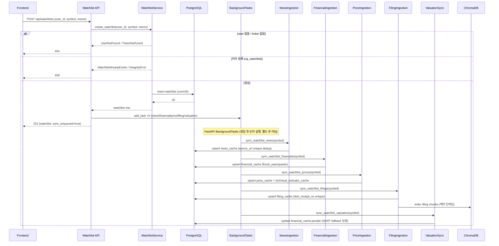
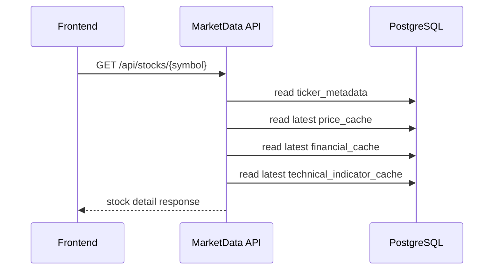
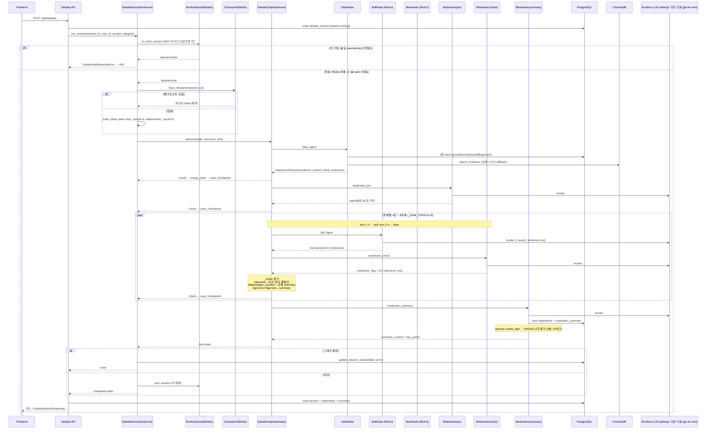
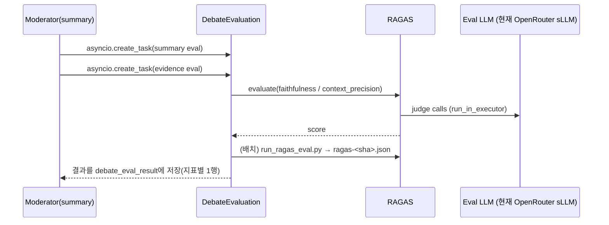
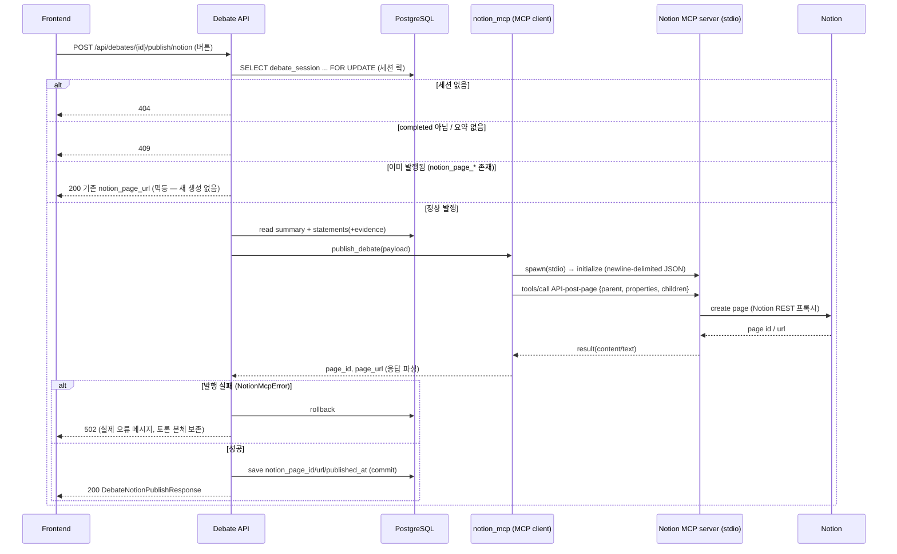
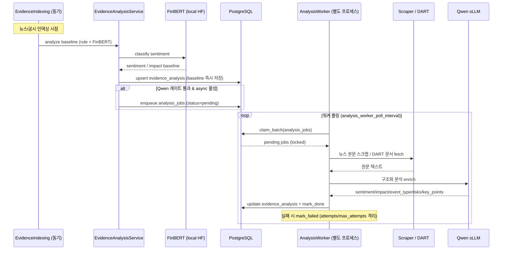

# 시퀀스 다이어그램

## 문서 목적

핵심 실행 흐름을 시퀀스 기준으로 설명한다.

## 1. 관심종목 추가 및 데이터 수집

> enqueue 자체가 실패하면 `sync_enqueued=false`로 응답하되 watchlist 생성은 유지(`watchlist.py:79–88`). background sync는 본 요청 트랜잭션과 분리.

## 2. 종목 상세 조회

## 3. AI 토론 실행

> **그래프 엣지(`debate_graph.py:58–73`)**: `START → data_agent → moderator_pre → bull_agent → moderator_check`, 그리고 `bear_agent → moderator_check`. `moderator_check`에서만 `add_conditional_edges(_router)`로 분기하고, **`judge_agent → moderator_summary → END`**.
> **`_router`(`:27–52`) 분기 우선순위**: ① `hallucination_count ≥ 2` → 종결 → ② `moderator_flag == "end"` → 종결 → ③ `current_topic_index ≥ 3` → 종결 → ④ `flag == "intervene"` → 직전 화자 재발언 → ⑤ 평상시 `turn∈{2,4}` → bear, `{1,3}` → bull.
> **종결 분기(`_final_node` `:23–24`)**: 종결 시 `decision_agent == "judge"`면 **`judge_agent`**(승패/판정, `moderator_node.py:224`) → `moderator_summary`, 기본(`moderator`)이면 `moderator_summary` 단독. `decision_agent`는 토론 시작 요청 바디에서 선택(`POST /api/debates`·`/sessions`).
> **상태 키**: `moderator_flag`(ok/intervene/end), `hallucination_count`, `current_turn`, `current_topic_index`, `agenda`, `statements`, `summary_content`, `key_points` (`debate_service._build_initial_state`).
> **복원력**: 매 노드 청크마다 `merge_state` 후 `save_checkpoint`(Redis 24h TTL, fail-soft) → 중단 시 `load_checkpoint`로 재개. 가드는 fail-open(Redis 장애 시 토론 허용).
> **LLM**: `llm_factory.get_llm(role)`이 role별 `settings.{bull,bear,moderator,fallback}_model`을 선택(기본 `gpt-4o-mini`). 현재 공급자는 OpenAI 직접(`openai_api_key`, base_url 미지정) — sLLM/OpenRouter 전환은 이 base_url 재배선이 진입점이라, 다이어그램은 특정 모델에 고정하지 않는다.

## 4. 토론 사후 평가

> ⚠️ **이 절의 평가 모델은 유동적이다**(OpenRouter sLLM 모델명 변경 가능). 단 **결과는 `debate_eval_result` 테이블에 영속화**되고 배치(`run_ragas_eval.py`)·리포트(`ragas-<sha>.json`)·회귀테스트(`test_ragas_regression.py`)까지 구현됨. 현재 메트릭 **3종**(faithfulness·answer_relevancy·context_precision).

- 현재값(변경 가능): 평가 LLM = `openai/gpt-oss-120b:free`(OpenRouter, `debate_evaluation.py:45`), 메트릭 = `faithfulness`·`answer_relevancy`·`context_precision`. 결과는 `debate_eval_result`에 저장.

## 5. 토론 결과 Notion 발행 (MCP)

> **발행 본체**: `app/integrations/notion_mcp.py`가 MCP client로 self-host `@notionhq/notion-mcp-server`(stdio)를 spawn → `API-post-page` 호출. transport는 **newline-delimited JSON**(MCP stdio 규격), 타임아웃·`isError` 표면화 처리.
> **저장 위치**: 속성(session_id/symbol/category/날짜)은 Notion DB property, 요약/핵심논점/주요발언은 페이지 본문 block(paragraph·bulleted).
> **멱등성**: `debate_session.notion_page_*`에 값이 있으면 재발행 대신 기존 URL 반환. **fail-soft**: 발행 실패(502)는 토론 본체 경로에 비전파(rollback).

## 6. 뉴스/공시 감성·투자분석 (동기 baseline + 비동기 Qwen)

> **2단 구조**: 동기 인덱싱이 FinBERT baseline을 즉시 `evidence_analysis`에 저장하므로 **워커가 안 떠 있어도 baseline 감성은 제공**된다. 무거운 Qwen 보강만 `analysis_jobs` 큐 → `python -m app.workers.analysis_worker`(별도 프로세스)가 후처리.
> **Qwen 서빙 백엔드**: `ANALYSIS_GENERATION_BACKEND=transformers`면 모델이 워커 프로세스에 1회 로드(메모리 비압박), `=remote`면 Ollama/vLLM(OpenAI 호환)을 HTTP 호출 → 워커 경량화 + 엔진 교체는 URL만.
> **관측성(Langfuse)**: 토글+키 활성 시, 위 enrich 1건이 `evidence-enrich` trace(부모 span)+Qwen generation으로 Langfuse에 기록되고 워커 종료 시 flush. 비활성이면 no-op.
> **노출**: 결과는 `GET /api/watchlists/{user_id}/feed`의 `WatchlistFeedItem` 필드(`sentiment`/`impact_score`/`event_type`/…)로 노출. 분석 전이면 null.

## 현재 시퀀스 상 주의 포인트

- watchlist background sync는 병렬 큐 시스템이 아니라 FastAPI background task 기반
- debate는 **두 경로**: ① 요청-응답형 일괄 반환(`POST /api/debates`, §3) ② **SSE 스트리밍**(`POST /api/debates/sessions`로 세션 선생성 → `GET /api/debates/{id}/stream`). 스트리밍은 §3 그래프 실행을 `astream` 노드 청크로 즉시 forward하고, 이벤트(`session_started`/`statement`/`summary`/`done`/`error`)로 내보냄. `completed` 세션은 DB replay, disconnect 시 `fail_session_if_running`으로 정리(인터페이스 정의서 §3 참조)
- **RAGAS 평가는 결과를 `debate_eval_result`에 영속화**하고 배치(`run_ragas_eval.py`)·리포트(`reports/ragas-<sha>.json`)·회귀테스트까지 구현됨. **golden set 10건 확장 완료**(평가 모델 변경 가능)
