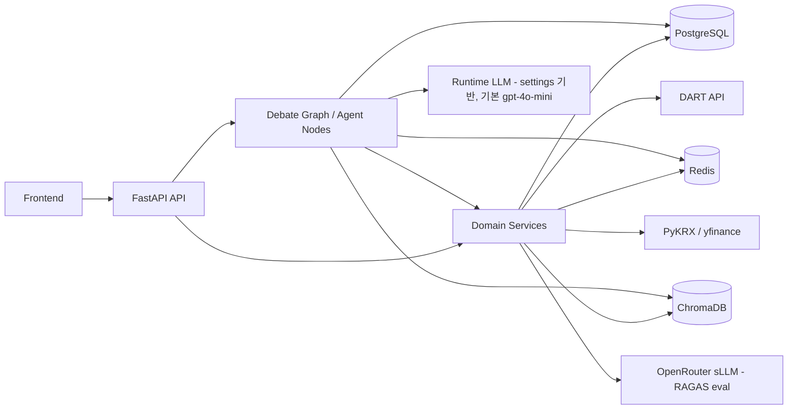

# 컴포넌트 설계서

## 문서 목적

TickerTaka 백엔드의 주요 컴포넌트와 책임, 데이터 흐름, 배포 환경을 설명한다.

## 상위 컴포넌트

1. API Layer
2. Domain Service Layer
3. Agent Runtime Layer
4. Persistence Layer
5. External Integration Layer
6. Infra Support Layer

## 1. API Layer

구성:
- `app/api/watchlist.py`
- `app/api/market_data.py`
- `app/api/debate.py`
- `app/main.py`

책임:
- HTTP 요청/응답 처리
- 입력 검증
- DB 세션 주입
- background task enqueue

## 2. Domain Service Layer

구성:
- `app/domain/watchlist_service.py`
- `app/domain/debate_service.py`
- `app/domain/news_ingestion.py`
- `app/domain/price_ingestion.py`
- `app/domain/financial_ingestion.py`
- `app/domain/filing_ingestion.py`
- `app/domain/evidence_retrieval.py`
- `app/domain/evidence_indexing.py`
- `app/domain/debate_evaluation.py`

책임:
- 비즈니스 규칙 실행
- 캐시 적재/갱신
- valuation 계산
- evidence 검색
- 사후 평가

## 3. Agent Runtime Layer

구성:
- `app/agents/debate_graph.py`
- `app/agents/state.py`
- `app/agents/nodes/data_node.py`
- `app/agents/nodes/bull_node.py`
- `app/agents/nodes/bear_node.py`
- `app/agents/nodes/moderator_node.py`

책임:
- 토론 상태 관리
- data context 수집
- bull/bear 논증 생성
- moderator 검증/요약

## 4. Persistence Layer

구성:
- PostgreSQL
- SQLAlchemy ORM models

핵심 테이블:
- `ticker_metadata`
- `watchlist`
- `price_cache`
- `financial_cache`
- `technical_indicator_cache`
- `news_cache`
- `filing_cache`
- `debate_session`
- `agent_statement`
- `moderator_summary`
- `evidence`
- `debate_note`
- `event_timeline`
- `data_refresh_job`

역할:
- 서비스의 단일 정합 저장소
- 토론 결과 및 캐시 저장

## 5. External Integration Layer

구성:
- `app/external/dart/client.py`
- `app/external/krx_client.py`
- `app/external/quote_client.py`
- `app/external/chroma_client.py`
- `app/core/llm_factory.py`

책임:
- DART 재무/공시 데이터 수집
- PyKRX 가격/기본지표 조회
- yfinance fallback
- Chroma query/upsert
- 토론 LLM 호출: `llm_factory.get_llm(role)`가 role별 `settings.{bull,bear,moderator,fallback}_model`을 선택(**기본 `gpt-4o-mini`**). 현재 공급자는 OpenAI 직접(`openai_api_key`, base_url 미지정)
- RAGAS 평가 LLM은 별도로 **OpenRouter sLLM** 사용 (`debate_evaluation.py`, 현재값 `gpt-oss-120b:free` — **RAGAS 1차 구현이라 모델/메트릭 변경 가능**)
- ※ `openrouter_base_url` 설정은 잔존하나 토론 경로엔 미적용 (항목3 sLLM 전환 시 재배선 지점)

## 6. Infra Support Layer

구성:
- Redis
- ChromaDB
- 설정/캐시/가드

관련 코드:
- `app/domain/intraday_quote.py`
- `app/agents/debate_checkpoint.py`
- `app/core/debate_runtime_guard.py`
- `app/core/llm_cache.py`

책임:
- 체크포인트
- active session guard
- intraday quote cache
- vector index 보조 저장

## 배포/실행 환경

현재 기준:

| 컴포넌트 | 위치 | 역할 |
|---|---|---|
| FastAPI app | 개발자 로컬 | API 및 agent runtime 실행 |
| PostgreSQL | NCP 원격 | 단일 SOT |
| Redis | 개발자 로컬 Docker | lock/checkpoint/quote cache |
| ChromaDB | 개발자 로컬 Docker | news/filing vector index |

정책:
- `DATABASE_URL`은 NCP 원격 호스트 유지
- `REDIS_URL`, `CHROMA_URL`은 로컬 또는 compose 서비스명 사용
- Redis/Chroma는 재생성 가능, PostgreSQL은 기준 데이터 저장소

## 컴포넌트 관계도

## 설계 원칙

- PostgreSQL 중심 정합성
- Redis/Chroma fail-soft
- 외부 소스 실패 시 graceful degradation
- API와 agent runtime 분리
- 평가/시연용 문서와 코드 경로 1:1 대응
