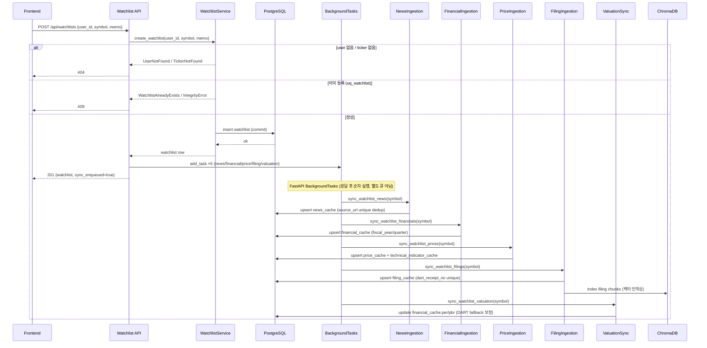
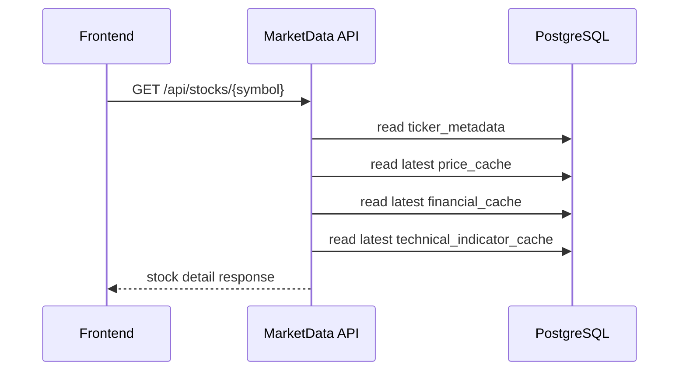
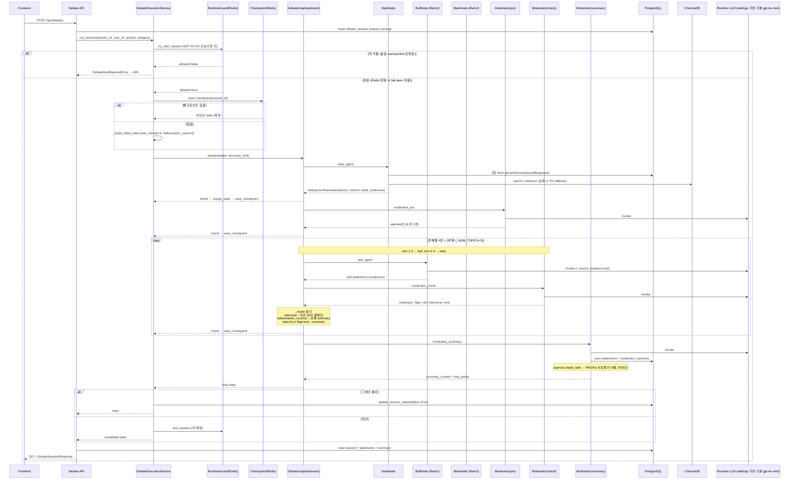
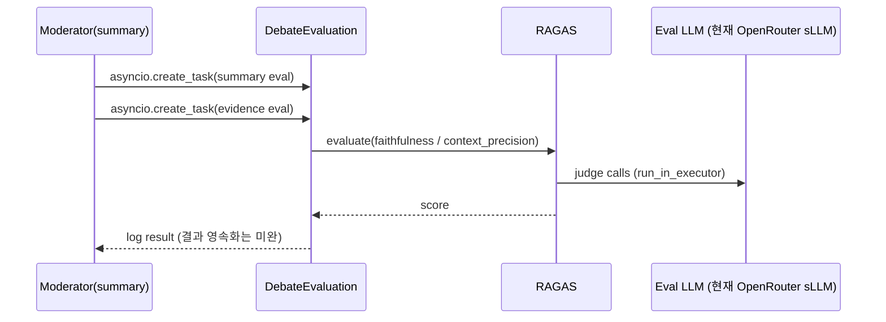

# 시퀀스 다이어그램

## 문서 목적

핵심 실행 흐름을 시퀀스 기준으로 설명한다.

## 1. 관심종목 추가 및 데이터 수집

> enqueue 자체가 실패하면 `sync_enqueued=false`로 응답하되 watchlist 생성은 유지(`watchlist.py:79–88`). background sync는 본 요청 트랜잭션과 분리.

## 2. 종목 상세 조회

## 3. AI 토론 실행

> **그래프 엣지(`debate_graph.py:60–66`)**: `START → data_agent → moderator_pre → bull_agent → moderator_check`, 그리고 `bear_agent → moderator_check`. `moderator_check`에서만 `add_conditional_edges(_router)`로 분기하고, `moderator_summary → END`.
> **`_router`(`:22–47`) 분기 우선순위**: ① `hallucination_count ≥ 2` → summary(강제종료) → ② `moderator_flag == "end"` → summary → ③ `current_topic_index ≥ 3` → summary → ④ `flag == "intervene"` → 직전 화자 재발언 → ⑤ 평상시 `turn∈{2,4}` → bear, `{1,3}` → bull.
> **상태 키**: `moderator_flag`(ok/intervene/end), `hallucination_count`, `current_turn`, `current_topic_index`, `agenda`, `statements`, `summary_content`, `key_points` (`debate_service._build_initial_state`).
> **복원력**: 매 노드 청크마다 `merge_state` 후 `save_checkpoint`(Redis 24h TTL, fail-soft) → 중단 시 `load_checkpoint`로 재개. 가드는 fail-open(Redis 장애 시 토론 허용).
> **LLM**: `llm_factory.get_llm(role)`이 role별 `settings.{bull,bear,moderator,fallback}_model`을 선택(기본 `gpt-4o-mini`). 현재 공급자는 OpenAI 직접(`openai_api_key`, base_url 미지정) — sLLM/OpenRouter 전환은 이 base_url 재배선이 진입점이라, 다이어그램은 특정 모델에 고정하지 않는다.

## 4. 토론 사후 평가

> ⚠️ **이 절은 RAGAS 1차 구현 기준이며 유동적이다.** 평가 모델·메트릭·영속화 방식이 바뀔 수 있다(현재 메트릭 2종, 결과 로그만, 배치/리포트 미완). 아래 모델명/메트릭은 *현재값*이며 확정 사양이 아니다.

- 현재값(변경 가능): 평가 LLM = `openai/gpt-oss-120b:free`(OpenRouter, `debate_evaluation.py:45`), 메트릭 = `faithfulness`·`context_precision`.

## 현재 시퀀스 상 주의 포인트

- watchlist background sync는 병렬 큐 시스템이 아니라 FastAPI background task 기반
- debate API는 현재 요청-응답형 완료 경로
- SSE streaming은 추후 별도 시퀀스로 확장 예정
- **RAGAS 평가는 1차 구현 단계** — 현재 로그 기반 사후 평가이며 결과 영속화·배치·리포트는 미완(메트릭/모델 변경 가능)
